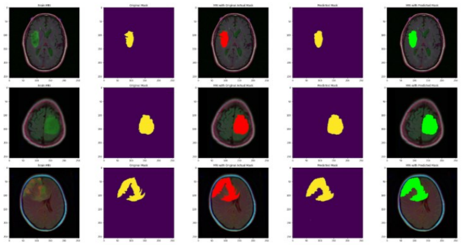

# 🎯 Software Engineer | AI Enthusiast
💡 Passionate about leveraging **Artificial Intelligence** to solve real-world challenges in **healthcare, sustainability, and automation**.  

### Projects
In-Silico Detection and Segmentation of Brain Tumors Using Deep Learning and Image Processing

🧠 **Impact**: Early and cost-effective detection of brain tumors, potentially saving lives.
🛠  **Tech Stack**: Python, TensorFlow, OpenCV, CNNs, Image Processing

- Developed an AI-based system to detect and localize brain tumors from MRI scans using Deep Learning.
- Applied CLAHE and filtering techniques to enhance MRI images before classification.
- Built a segmentation model to highlight tumors at the pixel level, improving diagnostic accuracy.
- Enables early tumor detection, reducing cancer diagnosis costs.
  
<figure>
  
  <figcaption>Figure 1: Input MRI scan and its corresponding mask, the MRI image with the actual mask, the mask predicted by the ResUNet model and the MRI image 
with the predicted mask</figcaption>
</figure>

